# Déploiement standardisé de postes Windows — Sysprep & Clonezilla

> Préparation d'un poste de référence Windows 10 conforme à un cahier des charges, généralisation avec Sysprep, capture d'une image disque avec Clonezilla, puis restauration sur une seconde machine et contrôle de conformité point par point.

**Contexte :** Projet d'école (PPE 5) — Geneva Institute of Technology, module IT Essentials / ICT-187 · septembre 2026 · projet individuel

**Technologies :** Windows 10 Pro · Sysprep · Clonezilla Live · VMware Workstation · PowerShell · Linux (parted, mkfs.ext4)

### Compétences mises en œuvre

- Rédaction d'un cahier des charges et d'une checklist de conformité
- Préparation d'un master : mises à jour, pilotes, logiciels, comptes (admin séparé / utilisateur standard)
- Généralisation Sysprep (OOBE, suppression du SID)
- Capture et restauration d'image disque avec Clonezilla (savedisk / restoredisk)
- Dépannage : préparation manuelle d'un disque vierge en ligne de commande Linux (GPT, ext4)
- Mesure du gain de temps et rédaction d'une procédure réutilisable par un autre technicien

---

> Une entreprise accueille des stagiaires et doit mettre à disposition 10 postes identiques, rapidement. Plutôt que d'installer chaque machine à la main, je prépare un poste de référence, j'en extrais une image système avec Clonezilla, puis je la redéploie sur une seconde machine pour prouver que la méthode fonctionne.

| Élément | Valeur |
| --- | --- |
| Cours | IT Essentials — ICT-187 (mettre en service un poste de travail avec son OS) |
| Classe / niveau | E1A — avancé |
| Durée | 1 semaine (PPA / PPE) |
| Hyperviseur | VMware Workstation |
| Système déployé | Windows 10 Pro 64 bits |
| Poste de référence | VM 1 — PC1 |
| Poste de test | VM 2 |
| Outils de déploiement | Sysprep (généralisation) + Clonezilla Live (image) |
| Réseau | VMnet8 (NAT), adressage DHCP |
| Temps mesurés | 2 h 30 en manuel / 1 h 30 par image |

---

## 1. Introduction et objectifs

### 1.1 Le besoin

Une entreprise accueille un groupe de stagiaires et doit leur fournir 10 postes de travail strictement identiques, dans un délai court. Installer chaque machine à la main serait long, répétitif et source d'erreurs : au bout de dix installations, il est presque certain que deux postes ne soient pas configurés exactement pareil, et c'est ensuite le support qui doit retrouver la différence.

Mon objectif est donc de préparer un seul poste de référence, d'en faire une image système, puis de redéployer cette image sur les autres machines pour obtenir un parc homogène en un minimum de temps.

### 1.2 Ce que je dois être capable de faire

- Comprendre le principe d'une image de référence et d'un déploiement reproductible.
- Préparer un poste de référence conforme à une configuration standard définie à l'avance.
- Créer une image système réutilisable sur d'autres machines.
- Vérifier le résultat du déploiement et le prouver par des captures d'écran.
- Documenter la procédure pour qu'un autre technicien puisse la refaire sans aide.

### 1.3 Périmètre retenu

Le scénario demande 10 postes. Je ne dispose pas de 10 machines, je travaille donc sur deux machines virtuelles VMware, ce que le formateur a validé : deux VM suffisent à démontrer la maîtrise de la méthode, puisque le déploiement des 8 postes restants consiste à répéter exactement la même opération de restauration.

| Machine | Rôle dans le projet |
| --- | --- |
| VM 1 — PC1 | Poste de référence : installation et configuration complètes, généralisation, puis création de l'image |
| VM 2 | Poste de test : réception de l'image, pour prouver que le déploiement fonctionne |
| Postes 3 à 10 | Non réalisés faute de matériel — ils reprendraient à l'identique la procédure appliquée à la VM 2 |

### 1.4 Méthode choisie

Trois options sont possibles : une image disque, un fichier de réponse pour une installation sans surveillance, ou un script de post-installation. Je retiens **l'image disque**, parce que c'est la solution la plus fidèle : elle restitue le poste exactement dans l'état où je l'ai validé, logiciels et paramètres compris, sans dépendre du bon déroulement d'une réinstallation.

Ma chaîne d'outils :

- **VMware Workstation** pour héberger les deux postes.
- **Windows 10 Pro** comme système de référence.
- **Sysprep** pour généraliser le poste de référence, c'est-à-dire supprimer ce qui lui est propre avant de le copier.
- **Clonezilla Live** pour capturer l'image du disque, puis la restaurer sur le second poste.

### 1.5 Étapes du projet

1. Rédiger le cahier des charges du poste standard.
2. Installer et configurer le poste de référence (VM 1).
3. Généraliser ce poste et créer l'image système.
4. Restaurer l'image sur la VM 2 et vérifier la conformité.
5. Mesurer et comparer les temps d'installation.
6. Rédiger la procédure de déploiement réutilisable.

---

## 2. Cahier des charges du poste standard

Ce cahier des charges définit ce que doit contenir un poste conforme. Il me sert de référence pendant l'installation, puis de liste de contrôle lors du test sur le second poste : chaque ligne doit pouvoir être vérifiée.

### 2.1 Système et matériel

| Élément | Valeur retenue | Pourquoi |
| --- | --- | --- |
| Système | Windows 10 Pro 64 bits (français) | Version professionnelle, nécessaire pour la gestion des comptes et l'intégration en entreprise |
| Disque | 80 Go | De la marge pour le système, la bureautique et d'éventuels logiciels supplémentaires |
| Mémoire vive | Allouée selon la machine hôte | Suffisante pour un usage bureautique fluide |
| Processeur | 8 cœurs alloués | Accélère l'installation et les mises à jour |
| Nom de machine | PC1 pour le poste de référence | Renommé à chaque déploiement, deux machines ne peuvent pas porter le même nom sur le réseau |

### 2.2 Logiciels

| Logiciel | Rôle |
| --- | --- |
| Microsoft Word | Traitement de texte |
| Microsoft Excel | Tableur |
| Microsoft PowerPoint | Présentations |
| Microsoft Outlook | Messagerie |
| Suite Microsoft 365 complète | Installée avec la licence Office |
| 7-Zip | Archivage et décompression |
| Microsoft Edge | Navigateur, fourni avec le système |

### 2.3 Comptes utilisateurs

Je garde une hiérarchie classique : un compte d'administration pour le support informatique, et un compte standard pour les stagiaires. Séparer les deux évite de travailler en administrateur au quotidien et limite les dégâts en cas de mauvaise manipulation ou d'infection.

| Compte | Type | Droits |
| --- | --- | --- |
| AdminIT | Administrateur local | Installation de logiciels, modification du système, dépannage — protégé par mot de passe |
| Stagiaire | Utilisateur standard | Bureautique uniquement, pas d'installation ni de modification du système — protégé par mot de passe |

### 2.4 Paramètres système et réseau

| Paramètre | Valeur attendue |
| --- | --- |
| Région | Suisse |
| Fuseau horaire | (UTC+01:00) Bruxelles, Copenhague, Madrid, Paris |
| Langue et clavier | Français |
| Mises à jour Windows | Installées et à jour au moment de la capture de l'image |
| Pilotes | Tous installés, aucun périphérique en erreur |
| Carte réseau | VMnet8 (NAT), adressage automatique par DHCP |
| Connectivité | Accès Internet fonctionnel depuis le poste |

### 2.5 Liste de contrôle du poste conforme

Ces sept points sont ma grille de vérification pour le test de l'étape 5.

| N° | Point à vérifier |
| --- | --- |
| 1 | Windows 10 Pro démarre correctement |
| 2 | Région et fuseau horaire corrects |
| 3 | Windows Update à jour |
| 4 | Aucun pilote manquant ou en erreur |
| 5 | Suite bureautique installée et fonctionnelle |
| 6 | 7-Zip installé |
| 7 | Comptes AdminIT et Stagiaire présents, avec leurs droits respectifs |

---

## 3. Installation du poste de référence (VM 1)

Je construis ici un poste 100 % conforme au cahier des charges. Je chronomètre le temps passé : il me servira de point de comparaison plus loin.

### 3.1 Création de la machine virtuelle

Je crée la machine virtuelle dans VMware Workstation en suivant l'assistant classique.


*Figure 1 — VMware Workstation : lancement de la création d'une nouvelle machine virtuelle*


*Figure 2 — Assistant de création, choix du type de configuration*


*Figure 3 — Poursuite de l'assistant de création*

Je sélectionne le fichier ISO d'installation de Windows 10 comme support d'installation.


*Figure 4 — Sélection de l'image ISO d'installation de Windows 10*

J'indique la version à installer, Windows 10 Pro, le nom de la machine — PC1 — et un mot de passe.


*Figure 5 — Version Windows 10 Pro, nom de la machine et mot de passe*

Je place le dossier de la machine virtuelle directement sur le disque C:. Il ne faut pas le mettre dans OneDrive ou un autre service de stockage en ligne : la synchronisation permanente des fichiers de disque virtuel fait perdre beaucoup de performances à la VM.


*Figure 6 — Choix de l'emplacement du dossier de la machine virtuelle*


*Figure 7 — Emplacement défini sur le disque local C:*

Je fixe la taille du disque virtuel à 80 Go, comme prévu au cahier des charges, pour être large si je veux installer d'autres logiciels.


*Figure 8 — Taille du disque virtuel : 80 Go*

### 3.2 Configuration matérielle de la VM

Avant le premier démarrage, j'ajuste le matériel virtuel.


*Figure 9 — Personnalisation du matériel de la machine virtuelle*

Je définis ici la quantité de mémoire vive attribuée à la machine.


*Figure 10 — Attribution de la mémoire vive*

Je monte le nombre de cœurs de processeur à 8 au total, ce qui accélère nettement l'installation et les mises à jour.


*Figure 11 — Attribution des processeurs : 8 cœurs au total*

Je mets la carte réseau en VMnet8, c'est-à-dire en NAT. Cette partie n'est pas obligatoire, c'est une préférence personnelle : le mode NAT donne un accès Internet à la VM sans l'exposer directement sur le réseau physique.


*Figure 12 — Carte réseau configurée sur VMnet8 (NAT)*

### 3.3 Installation de Windows

Je démarre la machine et l'installation de Windows se déroule normalement.


*Figure 13 — Démarrage de la machine virtuelle*


*Figure 14 — Installation de Windows 10 en cours*

L'installation prend un moment, il faut attendre qu'elle se termine avant de continuer.


*Figure 15 — Bureau Windows 10 : le système est installé et fonctionnel*

### 3.4 Mise à jour et paramétrage du système

Une fois Windows installé, je fais trois choses avant d'installer le moindre logiciel :

- installer les mises à jour Windows ;
- régler la région et le fuseau horaire ;
- vérifier que tous les pilotes sont bien installés.

#### a) Mises à jour Windows

Je passe par Paramètres → Mise à jour et sécurité → Windows Update. Les mises à jour se font avant la capture de l'image, sinon chaque poste déployé devrait les télécharger lui-même, ce qui annule une partie du gain de temps et laisse des failles connues ouvertes en attendant.


*Figure 16 — Accès aux paramètres de Windows Update*


*Figure 17 — Mises à jour disponibles, téléchargement et installation en cours*

Pendant qu'elles s'installent, je vais régler la région et le fuseau horaire.

#### b) Région et fuseau horaire


*Figure 18 — Paramètres de date et heure*


*Figure 19 — Réglage du fuseau horaire*


*Figure 20 — Réglage de la région*

#### c) Vérification des pilotes

Je vérifie les pilotes dans le gestionnaire de périphériques.


*Figure 21 — Ouverture du gestionnaire de périphériques*


*Figure 22 — Liste des périphériques*

Aucun triangle jaune n'apparaît dans la liste : tous mes pilotes sont donc à jour et correctement installés.

### 3.5 Installation des logiciels

J'installe la suite bureautique en la téléchargeant depuis le site officiel de Microsoft, puis je suis l'assistant d'installation. Passer par le site officiel évite les versions modifiées ou accompagnées de logiciels indésirables.


*Figure 23 — Téléchargement de Microsoft 365 depuis le site officiel Microsoft*

J'installe ensuite 7-Zip, ce qui complète la liste des logiciels prévus au cahier des charges.

### 3.6 Création et configuration des comptes

Je crée les comptes en PowerShell lancé en tant qu'administrateur. Je prends volontairement les commandes les plus simples possibles, pour pouvoir les retenir et les réutiliser facilement.

#### a) Compte d'administration

Je n'ai pas besoin de créer un nouveau compte administrateur : celui créé à l'installation de Windows fait déjà l'affaire, il suffit de le renommer. Cette commande affiche la liste des comptes locaux de la machine — chez moi, le compte s'appelle PC1.

```powershell
net user
```


*Figure 24 — Liste des comptes locaux de la machine, le compte s'appelle PC1*

Je le renomme en AdminIT.

```powershell
Rename-LocalUser -Name "PC1" -NewName "AdminIT"
```


*Figure 25 — Renommage du compte PC1 en AdminIT*


*Figure 26 — Vérification : le compte porte bien le nouveau nom*

Je n'avais pas mis de mot de passe à l'installation de la VM, je l'ajoute maintenant. L'astérisque demande la saisie du mot de passe de façon masquée, ce qui évite de l'écrire en clair dans la console.

```powershell
net user AdminIT *
```


*Figure 27 — Définition du mot de passe du compte AdminIT*


*Figure 28 — Mot de passe appliqué avec succès*

#### b) Compte stagiaire

Je crée maintenant le compte destiné aux stagiaires. Il est créé en utilisateur standard : il ne fait pas partie du groupe Administrateurs, il ne peut donc ni installer de logiciels ni modifier les paramètres système.

```powershell
net user Stagiaire /add
```


*Figure 29 — Création du compte Stagiaire*

Je lui attribue ensuite un mot de passe.

```powershell
net user Stagiaire *
```


*Figure 30 — Définition du mot de passe du compte Stagiaire*

À ce stade, le poste de référence est complet et conforme au cahier des charges.

---

## 4. Création de l'image système

Mon poste de référence est validé, je peux en extraire une image réutilisable sur les autres machines.

### 4.1 Point de restauration (snapshot)

Avant les manipulations sensibles, je crée un instantané de la VM 1 depuis le menu VM de VMware Workstation. Si quelque chose plante pendant la généralisation ou le clonage, je peux revenir à ce point de récupération au lieu de tout réinstaller.

### 4.2 Généralisation avec Sysprep

Sysprep supprime ce qui est propre à cette installation, en particulier l'identifiant unique du système (SID). Sans cette étape, tous les postes déployés partageraient le même identifiant, ce qui provoque des conflits sur le réseau et dans un domaine.

Je commence par couper le réseau, pour éviter que la machine ne se reconnecte ou ne télécharge quelque chose pendant la généralisation. Dans les paramètres de la VM, section Network Adapter, je décoche les deux premières cases du haut.


*Figure 31 — Déconnexion de la carte réseau dans les paramètres de la VM*

Je lance ensuite Sysprep avec Windows + R.


*Figure 32 — Ouverture de la boîte de dialogue Exécuter (Windows + R)*


*Figure 33 — Accès au dossier contenant Sysprep*


*Figure 34 — Sélection de sysprep.exe*

Je coche la case « Généraliser » et je choisis l'action « Arrêter », puis je valide. La machine s'éteint une fois la généralisation terminée, et c'est exactement l'état dans lequel je veux capturer le disque.


*Figure 35 — Options Sysprep : mode OOBE, case Généraliser cochée, action Arrêter*

### 4.3 Préparation de Clonezilla et du disque de stockage

Je télécharge Clonezilla Live sur ma machine. Je sélectionne le format ISO à la place du ZIP, parce que c'est ce format qui se monte directement comme lecteur de démarrage dans VMware.


*Figure 36 — Téléchargement de Clonezilla Live*


*Figure 37 — Sélection du format ISO à la place du ZIP*


*Figure 38 — Téléchargement de l'ISO Clonezilla terminé*

L'image doit être écrite quelque part, j'ajoute donc un second disque dur virtuel à la VM 1 pour servir de disque de stockage.


*Figure 39 — Ajout d'un nouveau disque dur à la VM 1*


*Figure 40 — Assistant d'ajout de disque*


*Figure 41 — Choix du type de disque*

Je sélectionne l'interface SATA.


*Figure 42 — Sélection de l'interface SATA*


*Figure 43 — Définition de la capacité du disque de stockage*


*Figure 44 — Options de création du disque*


*Figure 45 — Capacité confirmée*

Je donne un nom au fichier de disque.


*Figure 46 — Attribution d'un nom au fichier de disque*

Une fois le disque créé, je monte l'ISO de Clonezilla sur le lecteur virtuel de la VM.


*Figure 47 — Montage de l'ISO Clonezilla sur le lecteur de la VM*

### 4.4 Démarrage sur Clonezilla

Je démarre la VM avec l'option « Power on to Firmware ». Ça me permet d'entrer dans le BIOS/UEFI et de forcer le démarrage sur le lecteur contenant l'ISO plutôt que sur le disque Windows.


*Figure 48 — Démarrage de la VM avec l'option Power on to Firmware*


*Figure 49 — Menu de démarrage du firmware*


*Figure 50 — Sélection du lecteur contenant l'ISO Clonezilla*


*Figure 51 — Menu de démarrage de Clonezilla Live*


*Figure 52 — Chargement de Clonezilla*

Je sélectionne la langue de l'interface.


*Figure 53 — Choix de la langue*


*Figure 54 — Démarrage de Clonezilla*


*Figure 55 — Mode device-image : travailler entre un disque et un fichier image*


*Figure 56 — Choix de l'emplacement de destination de l'image*

### 4.5 Problème rencontré : le disque de stockage n'est pas formaté

À ce moment-là j'ai eu un problème : Clonezilla ne me proposait aucun disque de destination. Le disque que je venais d'ajouter était bien présent, mais complètement vierge, sans table de partition ni système de fichiers. Or Clonezilla ne peut écrire une image que sur un volume formaté qu'il sait monter.


*Figure 57 — Aucun disque de destination proposé, le disque n'est pas formaté*

Pour corriger ça, j'ai éteint la VM, je l'ai rallumée et j'ai coché les mêmes options qu'au lancement, mais cette fois je suis passé par le shell avant de démarrer l'assistant, pour préparer le disque à la main.


*Figure 58 — Accès au shell de Clonezilla avant le lancement de l'assistant*

Ça ouvre un petit menu, où je tape trois commandes. La première crée une table de partition GPT sur le disque, la deuxième crée une partition unique occupant tout l'espace, la troisième la formate en ext4.

```bash
sudo parted /dev/sda mklabel gpt
```

```bash
sudo parted /dev/sda mkpart primary ext4 0% 100%
```

```bash
sudo mkfs.ext4 /dev/sda1
```


*Figure 59 — Ouverture de l'invite de commande de Clonezilla*


*Figure 60 — Création de la table de partition GPT*


*Figure 61 — Création de la partition primaire sur tout le disque*


*Figure 62 — Formatage de la partition en ext4*


*Figure 63 — Formatage terminé*

Je sors du shell avec exit, ce qui me renvoie vers l'assistant Clonezilla.

```bash
exit
```


*Figure 64 — Sortie du shell*

### 4.6 Capture de l'image

Je relance Clonezilla et je reprends la procédure depuis le début.


*Figure 65 — Relance de Clonezilla*


*Figure 66 — Reprise de la procédure*

Cette fois j'ai bien un menu déroulant à droite, et je peux aller chercher mon disque sda1 formaté.


*Figure 67 — Le disque sda1 formaté est maintenant proposé comme destination*

Je valide avec Entrée et je continue la procédure.


*Figure 68 — Validation du disque de destination*


*Figure 69 — Poursuite de la procédure*


*Figure 70 — Montage du disque de destination*

Je valide ensuite avec « done ».


*Figure 71 — Validation par done*

Je sélectionne ma région.


*Figure 72 — Sélection de la région*

Puis le fuseau horaire.


*Figure 73 — Sélection du fuseau horaire*


*Figure 74 — Confirmation des paramètres régionaux*

Je donne un nom à mon fichier image. C'est ce nom qui me permettra de retrouver l'image au moment de la restaurer sur les autres postes, donc il vaut mieux qu'il soit explicite.


*Figure 75 — Attribution d'un nom au fichier image*


*Figure 76 — Choix du mode savedisk, sauvegarde du disque entier vers une image*


*Figure 77 — Sélection du disque source à capturer*


*Figure 78 — Options de compression et de vérification*


*Figure 79 — Options complémentaires*


*Figure 80 — Action à effectuer en fin d'opération*


*Figure 81 — Récapitulatif de la commande générée par Clonezilla*


*Figure 82 — Confirmation avant lancement*

L'opération se lance.


*Figure 83 — Capture de l'image en cours*

Le disque est cloné. Je retire maintenant le disque de stockage de la VM 1.


*Figure 84 — Retrait du disque de stockage des paramètres de la VM 1*


*Figure 85 — Disque détaché de la VM 1*

---

## 5. Test du déploiement sur la seconde machine

Le but de cette étape est de prouver que l'image fonctionne vraiment : je la déploie sur une machine différente, puis je vérifie point par point la conformité au cahier des charges.

### 5.1 État de la machine avant déploiement

La VM 2 est une machine vierge : aucun système d'exploitation, aucun logiciel, aucun compte utilisateur. Les captures ci-dessous constituent l'état « avant » du test.

Je rattache le disque contenant l'image à la VM 2, sur le même principe que pour la VM 1.


*Figure 86 — Avant déploiement : ajout du disque contenant l'image à la VM 2*


*Figure 87 — Assistant d'ajout de disque sur la VM 2*


*Figure 88 — Sélection d'un disque virtuel existant*


*Figure 89 — Sélection du fichier de disque contenant l'image*


*Figure 90 — Confirmation du rattachement*


*Figure 91 — Disque rattaché à la VM 2*

Je monte ensuite l'ISO de Clonezilla sur la VM 2.


*Figure 92 — Avant déploiement : montage de l'ISO Clonezilla sur la VM 2*

### 5.2 Restauration de l'image

Je démarre la VM 2 avec l'option « Power on to Firmware » pour amorcer sur Clonezilla.


*Figure 93 — Démarrage de la VM 2 sur le firmware*


*Figure 94 — Menu de démarrage*

Je prends la première ligne du menu Clonezilla.


*Figure 95 — Sélection de la première entrée du menu Clonezilla*

Je choisis ma langue.


*Figure 96 — Choix de la langue*

Je garde la disposition de clavier proposée par défaut.


*Figure 97 — Conservation de la disposition de clavier par défaut*

Et je démarre Clonezilla.


*Figure 98 — Démarrage de Clonezilla*

Je reprends le mode device-image.


*Figure 99 — Sélection du mode device-image*

Je prends local_dev, puisque l'image se trouve sur un disque local rattaché à la machine.


*Figure 100 — Sélection de local_dev comme emplacement de l'image*

Je sélectionne le disque.

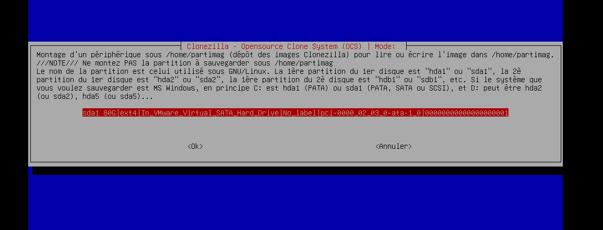
*Figure 102 — Reconnaissance du disque*

Je vais sur « done » en faisant Tab puis les flèches.

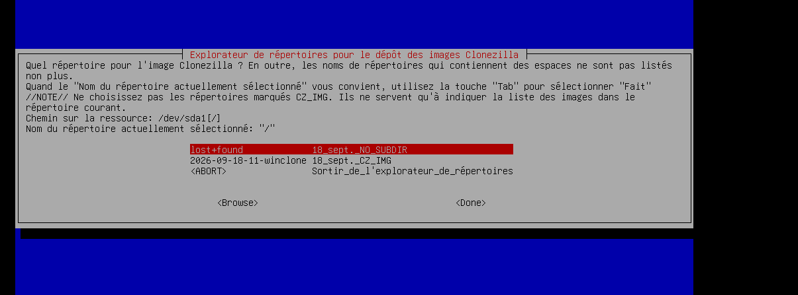
*Figure 103 — Validation par done*

Je continue de suivre les étapes.

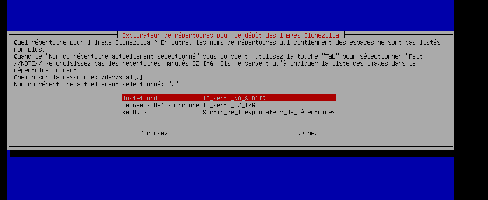
*Figure 104 — Sélection du répertoire de l'image*

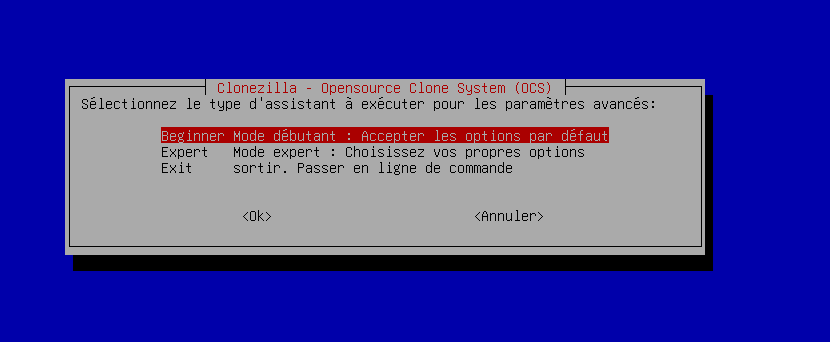
*Figure 105 — Mode d'exécution de l'assistant*

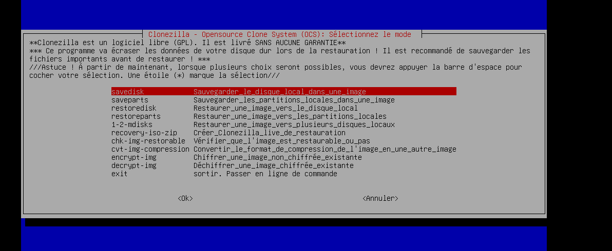
*Figure 106 — Menu des actions disponibles*

C'est ici que je sélectionne la restauration : l'option restoredisk écrit l'image capturée sur le disque de la VM 2.

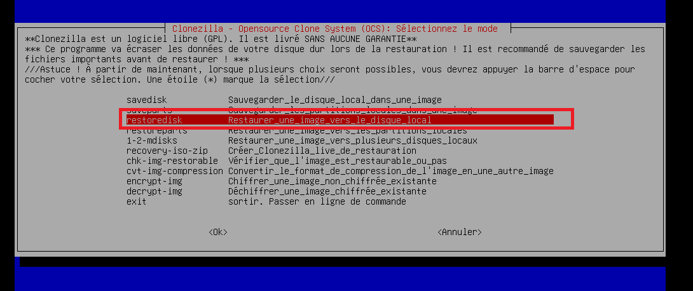
*Figure 107 — Sélection de l'option de restauration (restoredisk)*

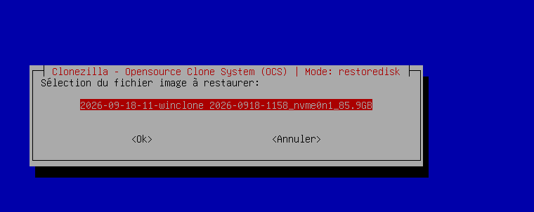
*Figure 108 — Sélection de l'image à restaurer*

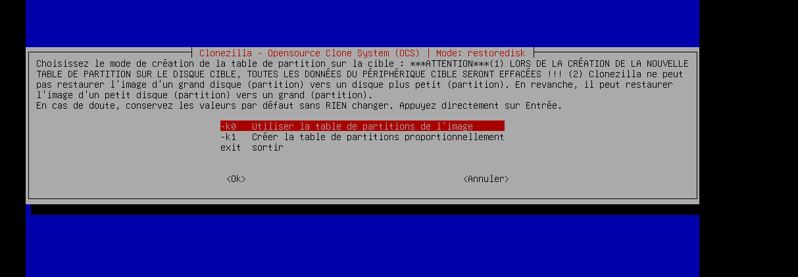
*Figure 109 — Mode de création de la table de partitions sur le disque cible (-k0 : utiliser la table de l'image)*

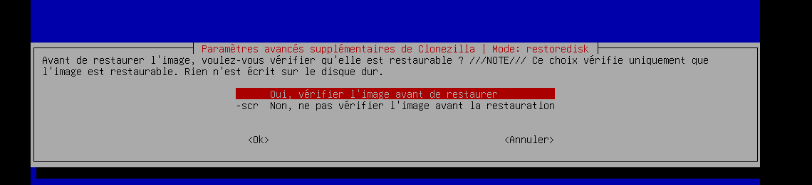
*Figure 110 — Option de vérification de l'image avant la restauration*

Je mets aussi poweroff en action de fin, pour que la machine s'éteigne toute seule une fois la restauration terminée.

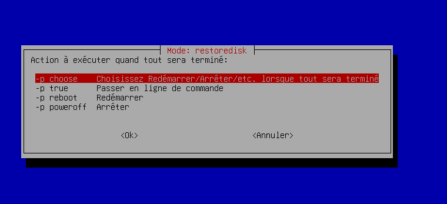
*Figure 111 — Action de fin : extinction automatique (poweroff)*

Avant d'écrire quoi que ce soit, Clonezilla vérifie que l'image est bien restaurable.

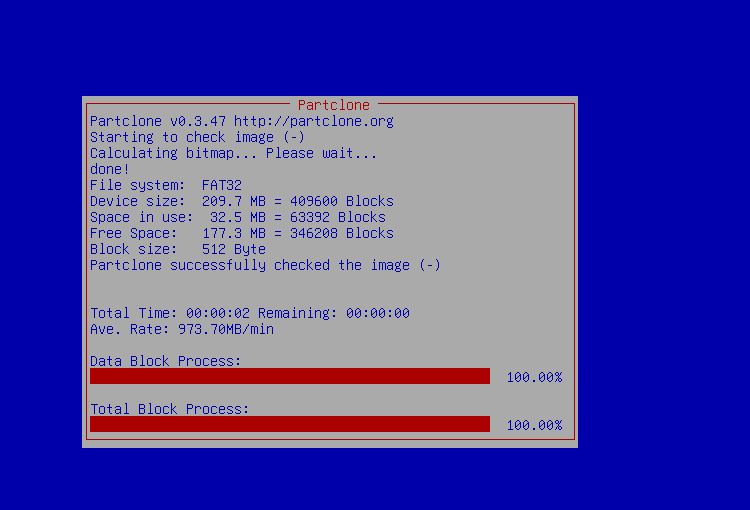
*Figure 112 — Vérification de l'image par Partclone terminée (100 %)*

Lors de ce premier essai, la restauration s'est ensuite arrêtée sur une erreur : le disque de la VM 2 était trop petit pour recevoir l'image (voir le paragraphe 8). Après avoir passé le disque de la VM 2 à 80 Go, j'ai relancé la même procédure, et cette fois la restauration est allée jusqu'au bout.

C'est fini, j'enlève maintenant le disque contenant l'image.

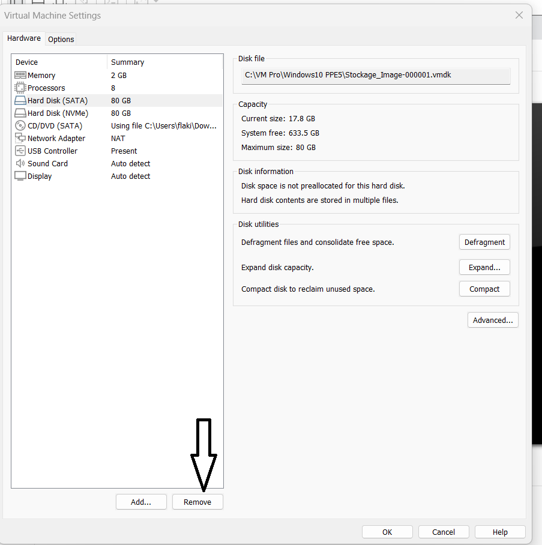
*Figure 113 — Retrait du disque contenant l'image*

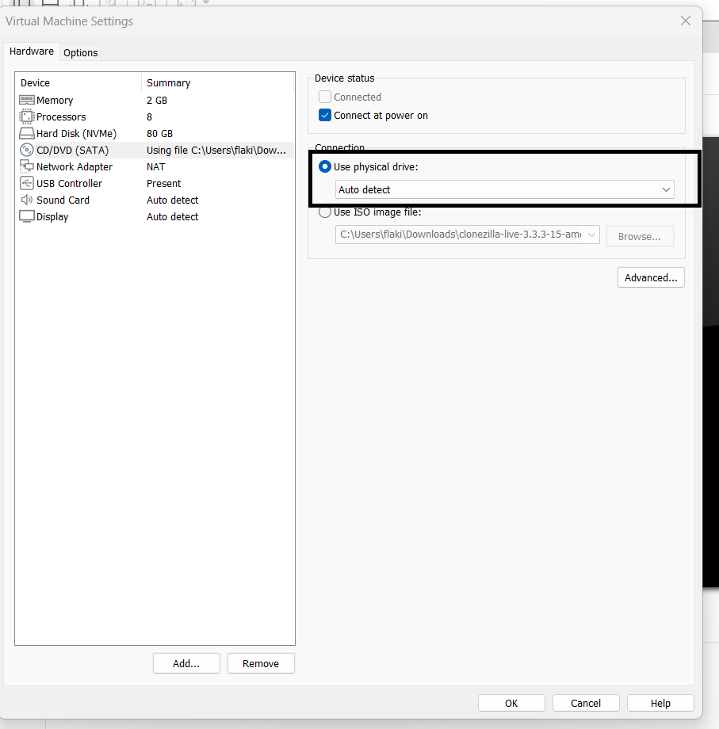
*Figure 114 — Disque image détaché et ISO Clonezilla retirée : il ne reste que le disque NVMe de 80 Go*

### 5.3 État de la machine après déploiement

Je démarre la VM 2 sur son propre disque, qui porte maintenant le système cloné. Ça démarre.

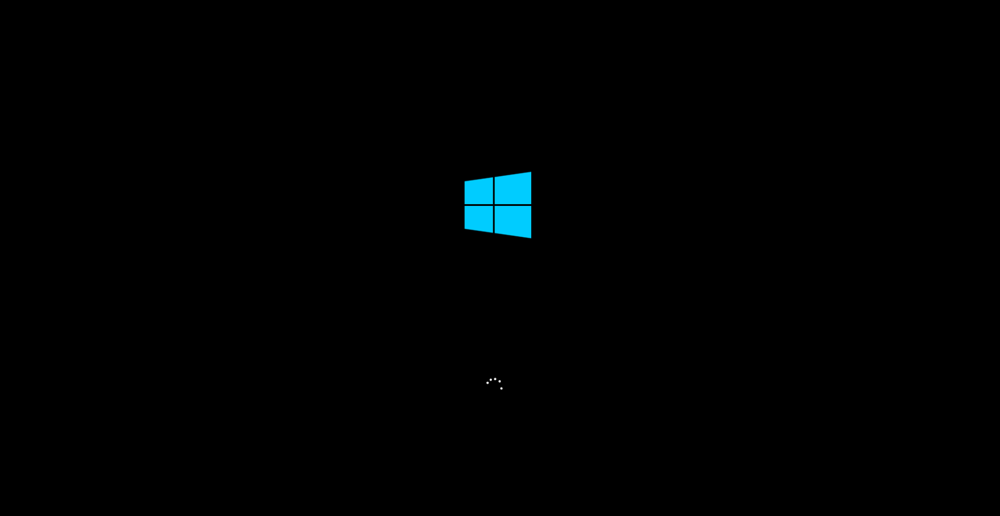
*Figure 115 — Après déploiement : démarrage de la VM 2 sur le système restauré*

Comme le poste de référence a été généralisé avec Sysprep, Windows redémarre sur l'assistant de première configuration et me demande les derniers paramètres. C'est le comportement attendu : ça permet de donner à chaque poste son identité propre tout en gardant la configuration commune.

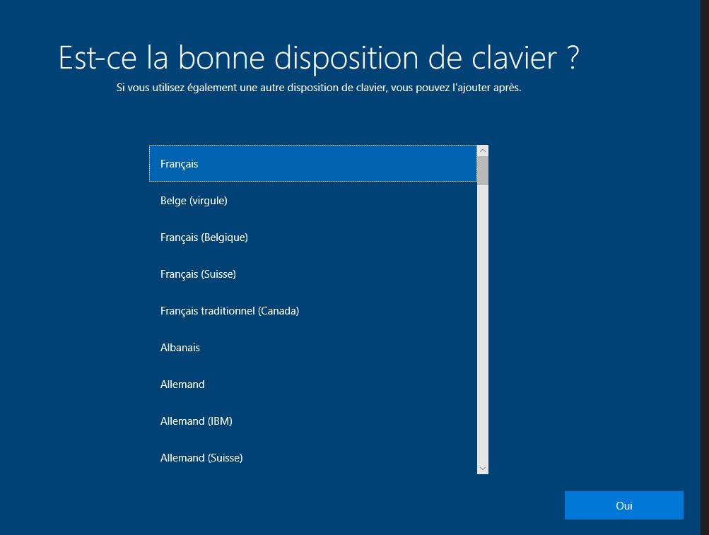
*Figure 116 — Après déploiement : assistant de première configuration (OOBE)*

Une fois la session ouverte, on peut voir que tous mes logiciels sont là.

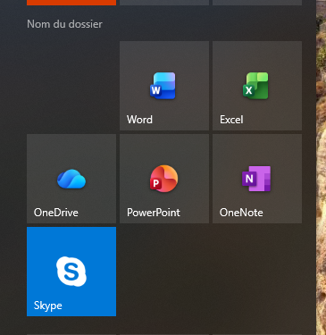
*Figure 117 — Après déploiement : les logiciels installés sont bien présents*

Word s'ouvre et fonctionne normalement.

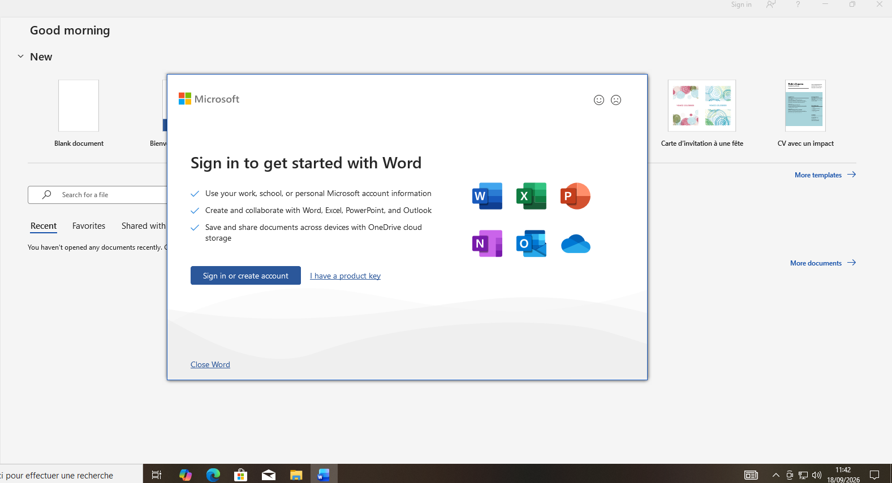
*Figure 118 — Après déploiement : ouverture de Microsoft Word sur la VM 2*

Les onglets en haut de VMware confirment qu'il s'agit bien de la seconde machine virtuelle, distincte de PC1 : le clonage a donc bien marché.

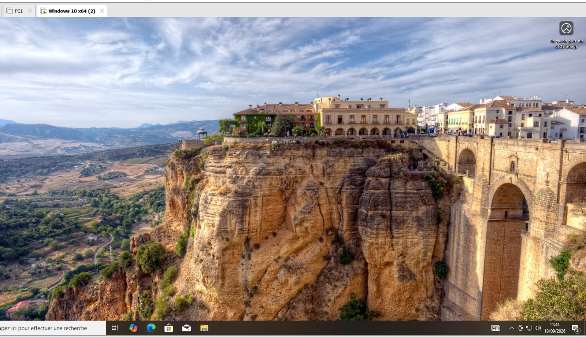
*Figure 119 — Après déploiement : bureau de la VM 2, distincte de PC1*

### 5.4 Contrôle de conformité au cahier des charges

J'ai vérifié chaque point de la liste de contrôle du paragraphe 2.5 sur le poste déployé.

| N° | Point vérifié | Résultat | Preuve |
| --- | --- | --- | --- |
| 1 | Windows 10 Pro démarre correctement | Conforme | Figures 115 à 119 |
| 2 | Région et fuseau horaire corrects | Conforme | Figure 116 |
| 3 | Windows Update à jour | Conforme | Hérité de l'image (figure 17) |
| 4 | Aucun pilote manquant ou en erreur | Conforme | Hérité de l'image (figure 22) |
| 5 | Suite bureautique installée et fonctionnelle | Conforme | Figures 117 et 118 |
| 6 | 7-Zip installé | Conforme | Figure 117 |
| 7 | Comptes AdminIT et Stagiaire présents | Conforme | Hérité de l'image (figures 26 et 29) |

**Résultat du test : le poste déployé est conforme au cahier des charges.** La méthode est validée et peut être appliquée telle quelle aux 8 postes restants.

---

## 6. Mesure et comparaison des temps

### 6.1 Temps mesurés

| Méthode | Durée mesurée | Ce que comprend la durée |
| --- | --- | --- |
| Installation manuelle complète | **2 h 30** | Installation de Windows, mises à jour, réglages régionaux, vérification des pilotes, installation des logiciels, création et configuration des comptes |
| Déploiement par image (Clonezilla) | **1 h 30** | Généralisation Sysprep, préparation du disque de stockage, capture de l'image, restauration sur la VM 2 et première configuration — problème du disque non formaté inclus |

La durée de 1 h 30 est pénalisée par le problème du disque de stockage non formaté (paragraphe 4.5). Sans cet imprévu, le déploiement aurait été sensiblement plus rapide.

### 6.2 Analyse

La comparaison brute donne déjà une heure de gagnée, soit environ 40 % de temps en moins. Mais l'essentiel n'est pas là : le temps de l'installation manuelle est à payer **pour chaque poste**, alors que la préparation de l'image — poste de référence, Sysprep, capture — n'est à payer **qu'une seule fois**. Seule la restauration se répète.

Le gain augmente donc avec le nombre de postes. Estimation pour les 10 postes du scénario, à partir de mes mesures :

| Scénario | Calcul | Total estimé |
| --- | --- | --- |
| 10 postes installés à la main | 10 × 2 h 30 | ≈ 25 h |
| 10 postes déployés par image | 2 h 30 (poste de référence) + préparation et capture de l'image + 10 restaurations | nettement inférieur à 25 h |

Il y a un autre avantage, qui ne se mesure pas en heures mais qui compte autant : les 10 postes sont rigoureusement identiques. Avec 10 installations manuelles, une différence de configuration finit toujours par apparaître sur l'un des postes, et c'est ensuite au support de la retrouver.

### 6.3 Conclusion de la comparaison

- Sur un seul poste, le déploiement par image fait déjà gagner une heure.
- Le coût de préparation de l'image est fixe, il est absorbé dès les premiers postes.
- Plus le parc est grand, plus la méthode est rentable.
- Le parc obtenu est homogène, ce qui simplifie durablement le support.

---

## 7. Procédure de déploiement

Cette procédure est écrite pour qu'un autre technicien puisse refaire le déploiement sans aide. Elle reprend sous forme condensée tout ce qui est décrit plus haut.

### 7.1 Prérequis

- VMware Workstation installé sur la machine hôte (ou un poste physique équivalent).
- Une image ISO de Windows 10 Pro 64 bits.
- Une image ISO de Clonezilla Live.
- La licence de la suite bureautique.
- Un disque de stockage destiné à recevoir l'image, formaté et disponible.
- Le cahier des charges du poste standard (chapitre 2).

### 7.2 Partie A — Préparer le poste de référence (une seule fois)

1. Créer la machine virtuelle : Windows 10 Pro, disque de 80 Go, mémoire et processeurs selon le cahier des charges, carte réseau en VMnet8.
2. Installer Windows 10 Pro en français.
3. Installer toutes les mises à jour Windows disponibles.
4. Régler la région (Suisse) et le fuseau horaire (UTC+01:00).
5. Vérifier dans le gestionnaire de périphériques qu'aucun périphérique n'est en erreur.
6. Installer la suite bureautique et 7-Zip.
7. Ouvrir PowerShell en tant qu'administrateur et configurer les comptes.
8. Vérifier le poste point par point avec la liste de contrôle du paragraphe 2.5.

Les commandes de l'étape 7 :

```powershell
net user
```

```powershell
Rename-LocalUser -Name "PC1" -NewName "AdminIT"
```

```powershell
net user AdminIT *
```

```powershell
net user Stagiaire /add
```

```powershell
net user Stagiaire *
```

### 7.3 Partie B — Créer l'image (une seule fois)

1. Créer un snapshot de la VM dans VMware (menu VM → Snapshot), pour pouvoir revenir en arrière en cas de problème.
2. Déconnecter la carte réseau dans les paramètres de la VM (décocher les deux cases du haut).
3. Lancer Sysprep : Windows + R, puis exécuter `sysprep.exe`.
4. Choisir le mode OOBE, cocher « Généraliser », choisir l'action « Arrêter », valider. La machine s'éteint seule.
5. Ajouter à la VM le disque de stockage qui recevra l'image (interface SATA).
6. Monter l'ISO de Clonezilla sur le lecteur de la VM.
7. Démarrer la VM avec « Power on to Firmware » et amorcer sur l'ISO Clonezilla.
8. Si le disque de stockage est neuf, le préparer depuis le shell Clonezilla avant de lancer l'assistant.
9. Dans Clonezilla : device-image → local_dev → sélectionner le disque de stockage → done.
10. Choisir le mode savedisk, nommer l'image de façon explicite, lancer la capture.
11. Une fois l'opération terminée, détacher le disque de stockage de la VM de référence.

Les commandes de l'étape 8 :

```bash
sudo parted /dev/sda mklabel gpt
```

```bash
sudo parted /dev/sda mkpart primary ext4 0% 100%
```

```bash
sudo mkfs.ext4 /dev/sda1
```

```bash
exit
```

### 7.4 Partie C — Déployer sur un poste (à répéter pour chaque poste)

1. Créer ou préparer la machine cible avec un disque d'au moins 80 Go.
2. Rattacher le disque contenant l'image à la machine cible.
3. Monter l'ISO de Clonezilla sur cette machine.
4. Démarrer avec « Power on to Firmware » et amorcer sur Clonezilla.
5. Choisir la langue, garder la disposition de clavier, démarrer Clonezilla.
6. Sélectionner device-image → local_dev → disque contenant l'image → done.
7. Choisir **restoredisk**, sélectionner l'image puis le disque de destination.
8. Régler l'action de fin sur poweroff et confirmer. ⚠️ Le disque de destination est entièrement écrasé.
9. Une fois la machine éteinte, détacher le disque contenant l'image et l'ISO de Clonezilla.
10. Démarrer la machine : Windows lance l'assistant de première configuration. Renseigner le nom du poste (PC2, PC3…) et les paramètres régionaux.
11. Vérifier le poste avec la liste de contrôle du paragraphe 2.5 avant de le livrer.

### 7.5 Points de vigilance

| Point | Pourquoi |
| --- | --- |
| Toujours passer par Sysprep avec l'option « Généraliser » | Sans généralisation, tous les postes partagent le même identifiant système, ce qui crée des conflits sur le réseau et dans un domaine |
| Couper le réseau avant Sysprep | Évite qu'une mise à jour ou une réactivation ne s'exécute pendant la généralisation |
| Le disque de destination doit être au moins aussi grand que le disque source | Clonezilla refuse de restaurer une image vers un disque plus petit (problème du paragraphe 8) |
| Vérifier le disque de destination avant restoredisk | Clonezilla écrase intégralement le disque choisi, sans retour possible |
| Formater le disque de stockage avant la capture | Clonezilla ne propose pas un disque vierge comme destination (problème du paragraphe 4.5) |
| Renommer chaque poste après déploiement | Deux machines ne peuvent pas porter le même nom sur le réseau |
| Créer un snapshot avant les manipulations sensibles | Permet de revenir en arrière sans devoir tout réinstaller |

---

## 8. Difficultés rencontrées

| Difficulté | Cause | Solution appliquée |
| --- | --- | --- |
| Clonezilla ne propose aucun disque de destination | Le disque virtuel ajouté était vierge, sans table de partition ni système de fichiers | Redémarrage sur Clonezilla, passage par le shell avant l'assistant et préparation manuelle du disque (`parted mklabel gpt`, `mkpart`, `mkfs.ext4`), puis reprise de la procédure |
| Échec de la restauration : « Le disque cible est trop petit » | Le disque de la VM 2 (60 Go) était plus petit que le disque source de l'image (80 Go). Clonezilla ne peut pas restaurer l'image d'un grand disque vers un disque plus petit | Passage du disque de la VM 2 à 80 Go dans VMware (même taille que la VM 1), puis nouvelle restauration réussie |
| Matériel limité à deux machines | Impossible de mobiliser 10 postes pour l'exercice | Réalisation sur deux VM validée par le formateur : VM 1 en poste de référence, VM 2 en poste de test, le reste du déploiement étant la répétition de la même opération |
| Risque de perte de performances de la VM | Stocker les fichiers de disque virtuel dans un dossier synchronisé en ligne (OneDrive ou équivalent) | Dossier de la VM placé directement sur le disque local C: |

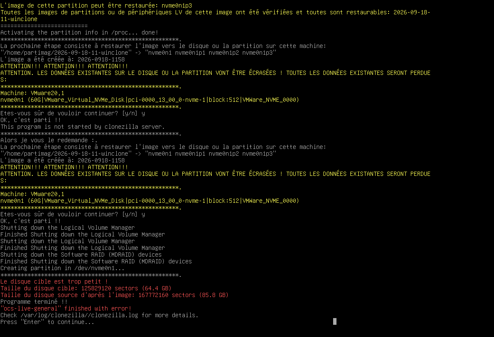
*Figure 120 — Premier essai de restauration : Clonezilla s'arrête avec « Le disque cible est trop petit » (disque cible 64,4 GB, disque source 85,8 GB)*

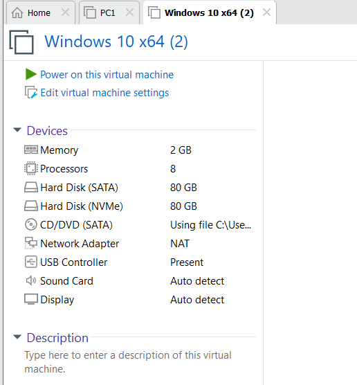
*Figure 121 — Après correction : le disque NVMe de la VM 2 est passé à 80 Go*

---

## 9. Récapitulatif de la configuration

| Élément | Configuration retenue |
| --- | --- |
| Hyperviseur | VMware Workstation |
| Système | Windows 10 Pro 64 bits, français |
| Disque | 80 Go |
| Processeur | 8 cœurs alloués |
| Réseau | VMnet8 (NAT), DHCP |
| Région / fuseau | Suisse / UTC+01:00 |
| Logiciels | Suite Microsoft 365 (Word, Excel, PowerPoint, Outlook), 7-Zip, Microsoft Edge |
| Compte administrateur | AdminIT, avec mot de passe |
| Compte utilisateur | Stagiaire, utilisateur standard, avec mot de passe |
| Généralisation | Sysprep, mode OOBE + Généraliser + Arrêter |
| Outil d'image | Clonezilla Live, mode device-image, savedisk / restoredisk |
| Poste de référence | VM 1 (PC1) |
| Poste de test | VM 2 |

---

## 10. Conclusion

L'objectif du projet est atteint : j'ai construit un poste de référence conforme au cahier des charges, je l'ai généralisé avec Sysprep, j'en ai capturé une image avec Clonezilla, et je l'ai restaurée avec succès sur une seconde machine. Le poste déployé a été contrôlé point par point et il est conforme.

La comparaison des temps montre un gain d'une heure dès le premier poste, et ce gain grandit avec le nombre de machines, puisque la préparation de l'image ne se fait qu'une fois. À ça s'ajoute un bénéfice difficile à chiffrer mais bien réel : l'homogénéité du parc, qui simplifie tout le support ensuite.

Ce que ce projet m'a appris de plus utile, c'est le problème du disque de stockage non formaté. Il a fallu comprendre que Clonezilla tourne sous Linux et a besoin d'un volume monté et formaté pour y écrire une image, puis préparer ce volume à la main en ligne de commande. C'était le passage le plus formateur, parce que c'est là que j'ai dû sortir de la procédure et comprendre ce qui se passait réellement.

### Améliorations avant une mise en production réelle

- Déployer réellement les 10 postes pour valider la méthode à l'échelle, et mesurer le temps d'une restauration seule afin de chiffrer précisément le gain.
- Préparer un fichier de réponse (`unattend.xml`) pour automatiser aussi l'assistant de première configuration, et éviter d'avoir à saisir manuellement le nom de chaque poste.
- Déployer par le réseau (Clonezilla SE ou PXE) au lieu de déplacer un disque d'une machine à l'autre, ce qui permettrait de traiter plusieurs postes en parallèle.
- Documenter une politique de mots de passe et intégrer les postes à un domaine plutôt que de gérer des comptes locaux machine par machine.
- Prévoir une mise à jour régulière de l'image de référence, sinon chaque poste déployé devra rattraper plusieurs mois de mises à jour Windows.

